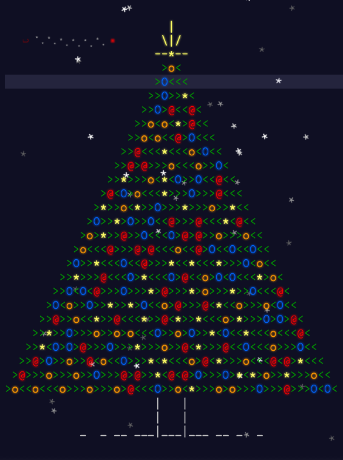

# Advent of Code 

My solutions for the [Advent Of Code](https://adventofcode.com) coding puzzles with [Python](https://www.python.org/)

## Statistics
| Year | Stars  |
| ---- | ------ |
| 2015 | 0 ⭐  |
| 2016 | 0 ⭐  |
| 2017 | 0 ⭐  |
| 2018 | 0 ⭐  | 
| 2019 | 0 ⭐  |
| 2020 | 0 ⭐  |
| 2021 | 0 ⭐  |
| 2022 | 36 ⭐ |
| 2023 | 2 ⭐  |

Total Stars: 38 ⭐

