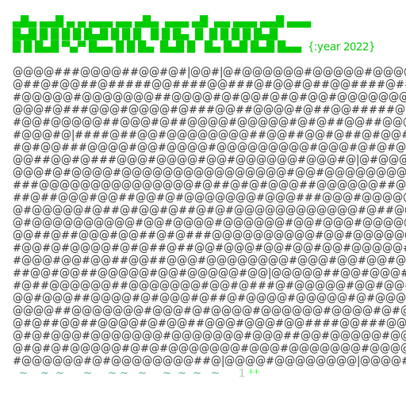

# Advent of Code 
My solutions for the Advent of Code 2022 problems with python. Check it out at https://adventofcode.com/2022.



Note: To run the algorithms, you must put your puzzle input it in each ```dayxx``` directory accordingly, since the AoC creator prefers that puzzle inputs don't be shared.